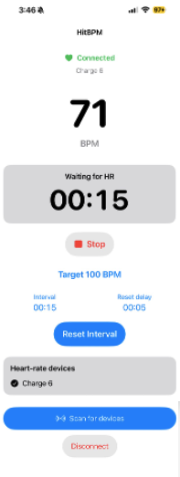

# HitBPM

## What the app do: 

**Hit your target. Start your interval.**

A simple iPhone app for heart-rate interval training with a Fitbit Charge 6.

- See your live heart rate at a glance.
- Choose a target heart rate and interval duration.
- The countdown starts when you reach your target and keeps running even if your heart rate drops.
- A beep and an on-screen message tell you when the interval is complete.
- Stop the interval anytime while keeping your live heart rate visible.
- Reset for another interval after an adjustable delay. Your settings stay saved.

Keep the app open during your workout—it keeps the screen awake.

### Background 

Research consistently shows that high-intensity aerobic interval training can substantially improve maximal oxygen uptake (VO₂max). One of the most extensively studied approaches is the 4 × 4-minute protocol, consisting of four 4-minute work intervals separated by approximately 3 minutes of active recovery.

In a landmark randomized controlled study, Helgerud et al. (2007) compared several endurance-training protocols matched for total work and training frequency. Participants performing 4 × 4-minute intervals at 90–95% of maximum heart rate (HRmax), with 3 minutes of active recovery at approximately 70% HRmax, trained three times per week for eight weeks. VO₂max increased by 7.2%, significantly more than with moderate continuous training at 70% HRmax or lactate-threshold training at 85% HRmax (Helgerud et al., 2007).

**Reference:**

Helgerud, J., Høydal, K., Wang, E., Karlsen, T., Berg, P., Bjerkaas, M., Simonsen, T., Helgesen, C., Hjorth, N., Bach, R., & Hoff, J. (2007). Aerobic high-intensity intervals improve VO₂max more than moderate training. Medicine & Science in Sports & Exercise, 39(4), 665–671. https://doi.org/10.1249/mss.0b013e3180304570
